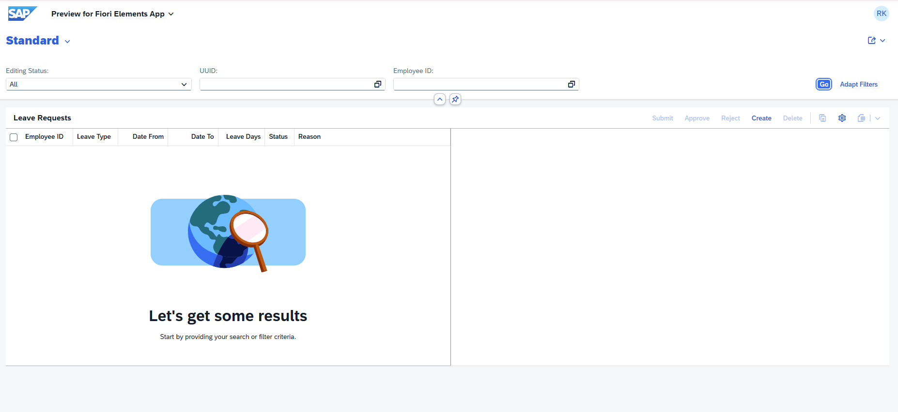
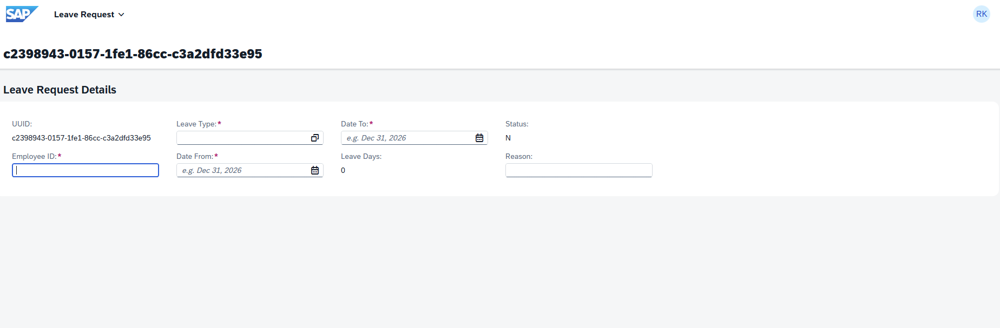
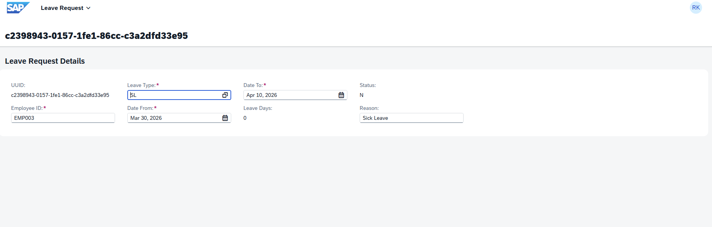
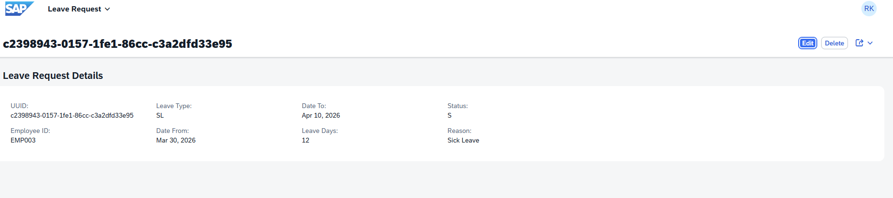
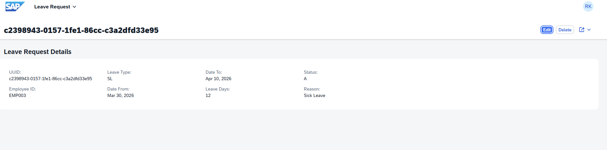
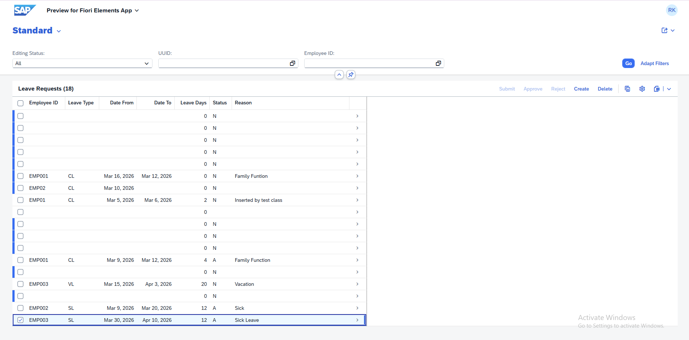
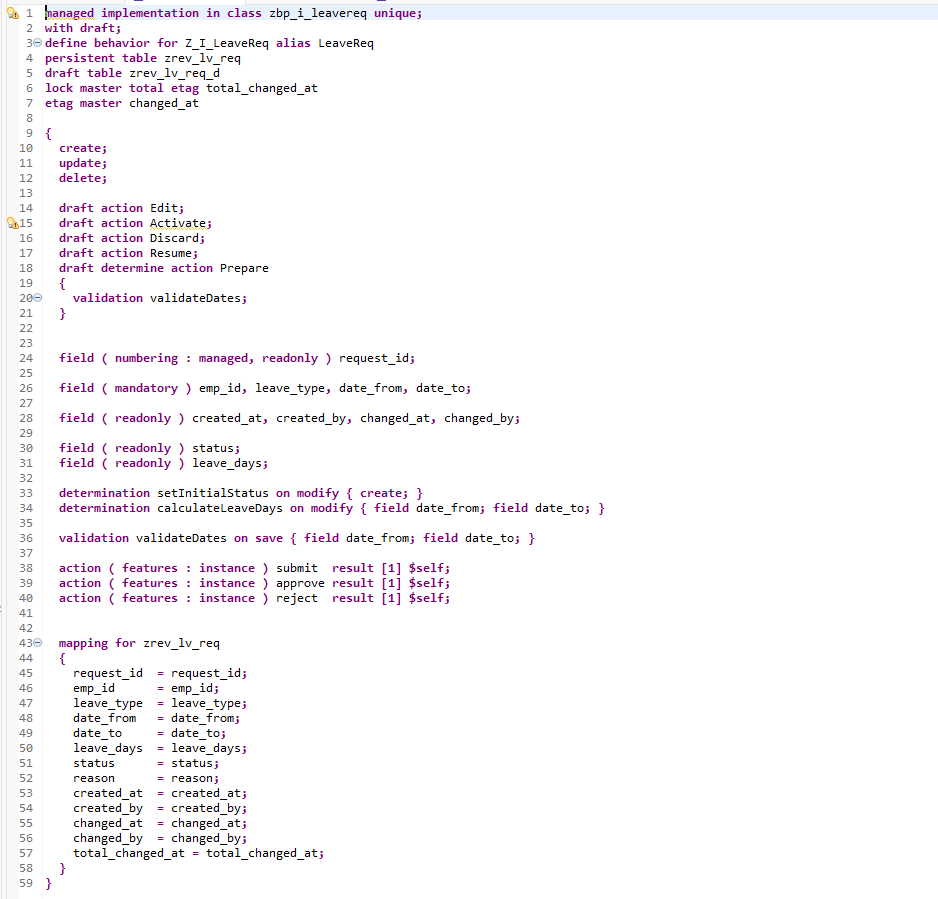
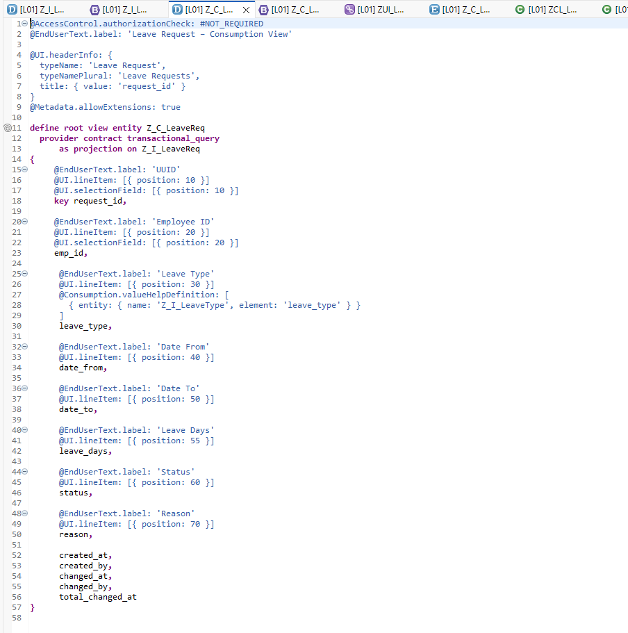
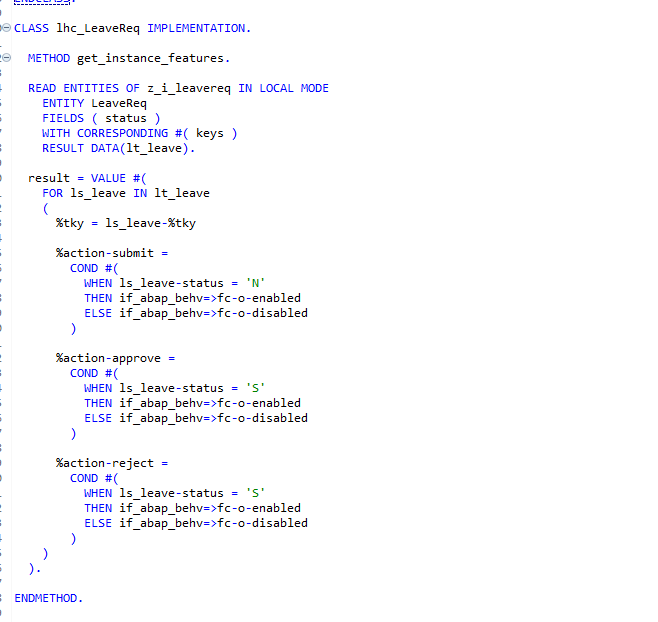

# SAP RAP Urlaubsantragsverwaltung

**Entwickelt von: Revathi Krishnamoorthy**

Dieses Projekt demonstriert eine **RAP-basierte SAP Anwendung** zur Verwaltung von Urlaubsanträgen mit **ABAP Cloud und Fiori Elements**.

## Funktionen

- RAP Business Object mit Draft-Funktion
- Implementierung von Determinations und Validations
- Workflow-Aktionen: **Submit, Approve, Reject**
- Instance Feature Control für die Aktivierung von Aktionen
- Value Help (Dropdown) für Leave Types
- OData V4 Service Binding
- Fiori Elements Benutzeroberfläche

## Verwendete Technologien

- ABAP Cloud
- RAP (RESTful Application Programming Model)
- CDS Views
- OData V4
- Fiori Elements
- ABAP Objects

## Geschäftslogik

Statuswerte im Workflow:

- `N` = New
- `S` = Submitted
- `A` = Approved
- `R` = Rejected

## Screenshots

### 1. Listenansicht der Anwendung

### 2. Erstellung eines neuen Urlaubsantrags

### 3. Value Help für Leave Type

### 4. Antrag nach dem Submit

### 5. Genehmigter Antrag

### 6. Feature Control (Aktivierte/Deaktivierte Aktionen)

### 7. Behavior Definition (RAP)

### 8. CDS Projection View

### 9. Handler Klasse (Actions)

